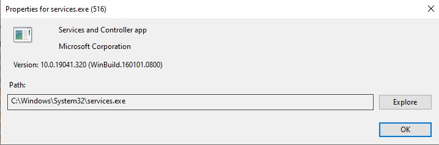
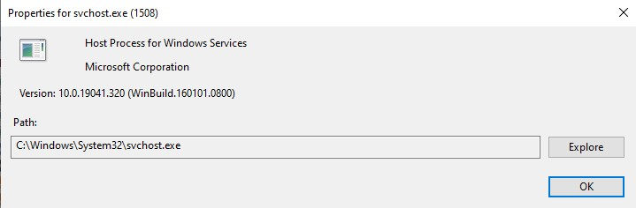
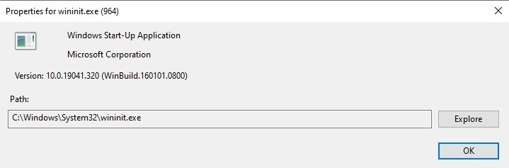

# Lab 3.0.3 — Identify Running Processes: TCPView Analysis

**Course:** Cisco CyberOps Associate
**Module:** 3.0.3 - Identify Running Processes
**Date:** March 2026
**Author:** Christos Panopoulos
**Tool Used:** Windows Sysinternals TCPView

---

## Objective
Use TCPView to identify and analyze running processes 
and network connections on a Windows system.

---

## Part 3 — Windows System Processes
**lsass.exe** (Local Security Authority Process) is located at 
C:\Windows\System32\lsass.exe. It is a critical Windows process
responsible for enforcing security policies, user authentication
and password changes. It is a prime target for attackers for credential 
dumping attacks such as those performed by Mimikatz. Attackers also
commonly deploy malware using a similar filename — replacing the 
lowercase 'l' with an uppercase 'I' to disguise the malware as a 
legitimate Windows process.

### Other Processes
**services.exe** — Services and Controller app, located at 
C:\Windows\System32\services.exe. Responsible for starting, 
stopping, and managing Windows background services.

**svchost.exe** — Host Process for Windows Services, located at 
C:\Windows\System32\svchost.exe. Acts as a container for 
multiple Windows services running as DLLs.

**wininit.exe** — Windows Start-Up Application, located at 
C:\Windows\System32\wininit.exe. Responsible for initializing 
core Windows services during system startup.

---

## Part 4 — User-Started Process Analysis

### Opening Chrome
Upon opening Chrome, new processes immediately appeared in 
TCPView showing chrome.exe with UDP connections on port 5353, 
indicating mDNS (Multicast DNS) activity — a protocol Chrome 
uses to discover local network devices such as Chromecast 
for casting functionality.

### Active Connections
With Chrome actively browsing, TCPView showed multiple 
established TCP and TCPv6 connections on port 443 (HTTPS), 
connecting to external IP addresses, including 13.225.35.120 
and 18.97.36.63, confirming encrypted web traffic to remote 
servers.

### Closing Chrome
Upon closing Chrome, the established connections changed to 
a red-highlighted state in TCPView, indicating the connections 
were being terminated, and the entries disappeared shortly after.

---

## Key Observations
After completing the lab and experimenting with TCPView, I was
surprised by how accessible a critical process such as 
lsass.exe is on a Windows system - a process that is a primary
target of attacks. Observing how much network activity a single
web browser instantly produces would otherwise go unnoticed 
without a monitoring tool. Understanding the normal baseline network
activity is essential to locate any anomalous behavior that 
could indicate a compromise - a fundamental skill for any SOC analyst.
