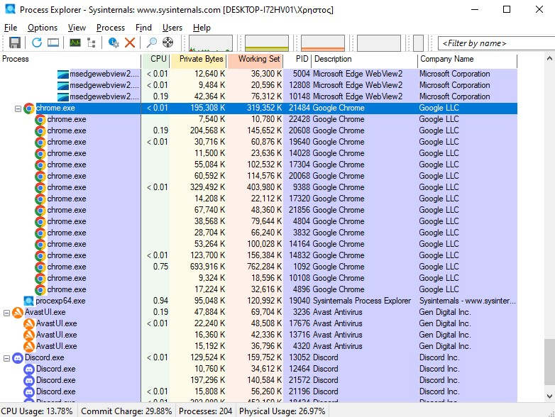
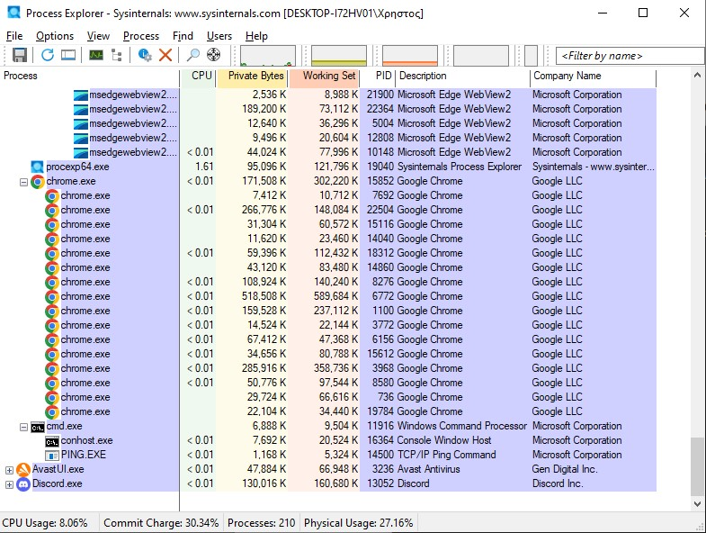
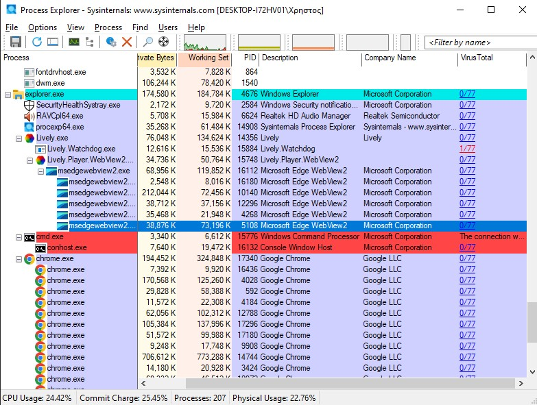
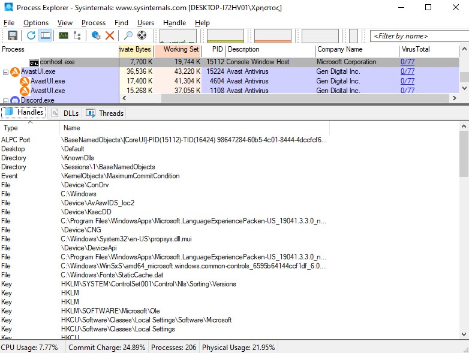
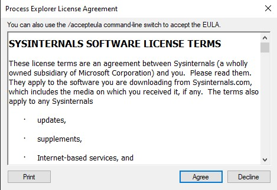

# Lab 3.2.11 — Exploring Processes, Threads, Handles, and Windows Registry

**Course:** Cisco CyberOps Associate
**Module:** 3.2.11
**Date:** March 2026
**Author:** Christos Panopoulos
**Tool Used:** Windows Sysinternals Process Explorer, 
Registry Editor

---

## Objective
Use Process Explorer to analyze processes, threads, 
and handles, and use the Windows Registry to modify 
application behavior.

---

## Part 1 — Exploring Processes

### Active Process Identification
To find a specific process, click the Find Window's Process button at the top and drag it to the
process window you want to locate, and the process gets highlighted. The  process in that case is
chrome.exe, and all of the child processes below. A lot of processes are running
simultaneously, this is because of Chrome's multi-process architecture, where every tab, extension
and plugin run as a separate process for security reasons.

### Killing a Process
Upon killing the parent chrome.exe process, every Chrome connection is terminated simultaneously,
including all the child processes that depend on it, as shown by the red highlight in Process Explorer.
This is an important forensics concept — terminating a parent process cascades through all its 
children.

### Command Prompt Tree
By using the Find Window's Process tool to locate the Command Prompt, identified as cmd.exe, it is
clear that cmd.exe is the parent process with conhost.exe as the child process. However is important
to mention that cmd.exe is a child of explorer.exe - the Windows shell responsible for launching 
user applications.

### Ping Command Observation
While running a command, such as ping, on the command prompt process, we observe that a new child
process is now shown, called PING.exe. This test shows how parent processes spawn child 
processes based on the actions they need to perform, while Process Explorer helps us
visualize these changes in real time. Once the ping is completed, PING.EXE disappears 
from the process tree.

### VirtualTotal analysis - conhost.exe
By right-clicking on the conhost.exe process and selecting Check VirtualTotal, a score is shown
0/72 - meaning no security vendors flagged the file as dangerous/malicious. When the score is
clicked, we get redirected to the VirtualTotal page showing results in detail.

While reviewing other processes on the VirusTotal column, it is interesting to observe the Process
Lively.Watchdog.exe with 1/72 - flagged by one vendor as malicious. This demonstrates the practical
value of VirusTotal, as running it against all the running processes could locate a possibly
malicious process that went undetected up until then.

### Killing cmd.exe 
As demonstrated before, upon killing the cmd.exe process, conhost.exe is also simultaneously 
terminated, showing the hierarchical nature of Windows process management.

## Part 2 - Threads & Handles

### Part 2.1 - Threads
Selecting the conhost.exe process and opening Properties, we access everything there is to know
about the conhost.exe. Specifically, we check the thread tab, where we can see the five
threads that conhost.exe is running simultaneously. Each thread displayed 
its Thread ID, CPU usage, Cycles Delta, Suspend Count, and Start Address, indicating which
module spawned it. By clicking on any thread, even more detailed information appears for the
selected thread, like the state, which in our case is "Wait:UserInput" - meaning it is idle 
and waiting for the user to input a command.

### Part 2.2 - Handles
For a user to show the handles of a process, the Lower Panel View needs to be toggled at the top
of the tab. Once it is enabled, we can select any process from the list and check its handles.
In this case, we check conhost.exe handles, which reveal multiple references
across the system's resources, including files, keys, directories, and kernel events. File handles
point to Windows core system files, and key handles refer to entries on the Windows Registry.
This demonstrates that even a small console process like conhost.exe maintains a wide range
of references to system resources simultaneously.

## Part 3 - Windows Registry

### EulaAccepted Key — Initial Value
The Windows Registry Viewer was opened and navigated to HKEY_CURRENT_USER->SOFTWARE->Sysinternals->
Process Explorer.
Scrolling down the list of values, we locate EulaAccepted Key with a value of 0x00000001 (1), confirming 
that the End User Agreement for Process Explorer has been accepted. The Windows Registry stores 
numerous other configuration keys stored for Process Explorer, demonstrating how Windows applications
store their configuration data as keys in the registry rather than in separate configuration files.

### Registry Value Modification
Double-clicking the EulaAccepted Key offers the option to modify the registry key and change its value to 0 -
meaning the agreement is no longer accepter from the user. Now, upon reopening Process Explorer, the agreement
will be shown again - demonstrating how a single registry value can affect the behavior of an application.

---

## Key Observations
After completing the lab and experimenting with Process Explorer, I was surprised by the number of references
and key values each small process can require to run properly. Seeing how the Windows Registry interacts with
each application raises major security concerns about how an attacker can disturb every application by simply
accessing the Windows Registry, for that reason, it is important to always apply least privilege policies to
the devices.

