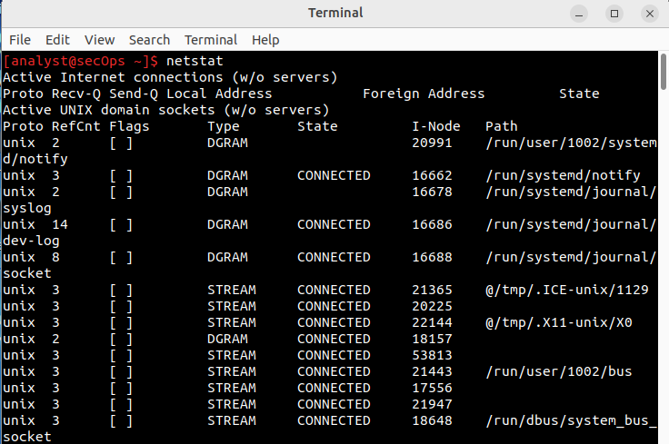
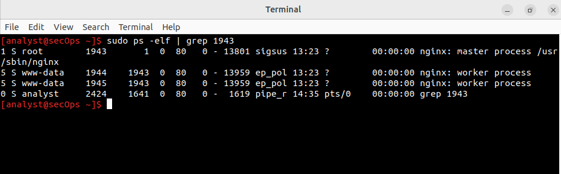

# Lab 4.3.4 — Linux Servers

**Course:** Cisco CyberOps Associate  
**Category:** Practical / Hands-On  
**Platform:** CyberOps Workstation Virtual Machine (Linux)  
**Date Completed:** April 2026

---

## Objective
This lab focuses on listing, locating, and connecting to certain programs
that Linux computers run in the background - those programs are often called
services or daemons. Commands, such as `ps`, `netstat`, and `telnet`, will be used
in this lab to interact with the services. An analyst often investigates those services
to possibly detect unusual services running on a machine, like backdoors.

---
## Part 1: Servers

### Step 1: Display Services Currently Running

#### Step 1a — ps command
The `ps` command is used to display a list of processes running on a machine.
An analyst can use different options together with the `ps` command to display
the output in a variety of formats, by using `ps -elf` to show a detailed list of 
services, like PID and PPID, or `ps -ejH` for a parent-child hierarchy, where 
malware usually attempts to hide under legitimate parent processes.

For an analyst to display all the available processes, elevated privileges are
required, so the use of `sudo` is needed to execute a command as root.

---

#### Step 1c — netstat Basic Output
The `netstat` command is used to list all the network connections and ports running on a machine.
The command displays two types of servers, the Active Internet connections, which
contain the TCP and UDP connections between machines over the Internet, and 
the Active UNIX domain sockets, which contain the communications between programs
on the same machine. Malware usually uses UNIX domain sockets to avoid generating 
traffic and triggering alerts.

---

#### Step 1d — netstat -tunap
The `netstat` command can be run with a variety of options, like `-t` to display the TCP
connections, `-u` to display the UDP connections, `-n` to display the IP addresses as numeric
and not hostname, `-a` to show all connections, including listening ports and not established ones,
and `-p` to show the PID of the programs using the connection.

Running `netstat -tunap` shows a complete map of every open port, protocol, state, and Program name.
This is one of the first commands for an analyst to execute when investigating an incident.

---

#### Step 1e — ps and grep to identify nginx
An analyst can use `ps` to display properties together with `grep` to
search for the specific text patterns, like PID, or Ports, by using the `|` pipe
to connect the two commands. The `ps -elf | grep 1943` shows all the processes
running for the 1943 PID.

The output of running a command with grep about a specific process is used during
investigations to find out more information about a specific PID. Linux distros 
implement a security measure called privilege separation by running the parent
process on root privileges and the child processes that, in our case, handle web
requests with lower privileges for security purposes.

---

## Part 2: Using Telnet to Test TCP Services

### Step 2a — Telnet to Port 80 (nginx)
Telnet is a tool that lets you connect to any open TCP port and communicate with 
the service running there. Telnet is insecure as it transmits information as plain
text, making it easy for anyone monitoring the network to intercept and read the 
entire session.

When attempting to communicate via telnet and sending unrecognized input, telnet
displays a 400 HTTP error code, meaning it is connected to a real web server and 
also displaying as plain text the server's version, which an attacker can use to
search for CVE known vulnerabilities for the specific server version. Trying to 
locate service information and version as an attacker is called banner grabbing.

---

### Step 2b — Telnet to Port 22 (SSH)
When connecting to port 22 via telnet, it will immediately display
a banner with the protocol version, the software, and the software's
exact version. By sending invalid input to SSH, and not a proper SSH handshake response
the connection gets terminated, and an error gets displayed.

Similar to nginx response, SSH offers the attacker valuable information that can 
be used to find a CVE vulnerability for the SSH version or software version. SSH should
replace telnet as it encrypts the data transmitted through a network compared to the plain
text format that telnet implements.

---

### Step 2c — Telnet to Port 68
While attempting to connect to port 68 via telnet, the connection is 
refused. Port 68 is using the UDP protocol, and telnet can only connect to open TCP 
ports, so the connection is not successful. Telnet is a limited tool that can only
be proven effective when used against TCP ports. An analyst should know which tools
to use based on the protocol: telnet for TCP ports and netcat for UDP ports.

---

## Key Observations
As an analyst, to properly use commands like `ps`, `netstat -tunap`, and `telnet`
to identify and connect to processes and services, can form a core investigative
methodology for identifying malicious processes on a machine, like discovering an 
unknown service running on port 4444, usually used by Metasploit reverse shell. 
The ability of the telnet tool to offer attackers version information via banner
grabbing, which can be used to research known CVE vulnerabilities, is a critical 
security risk.

